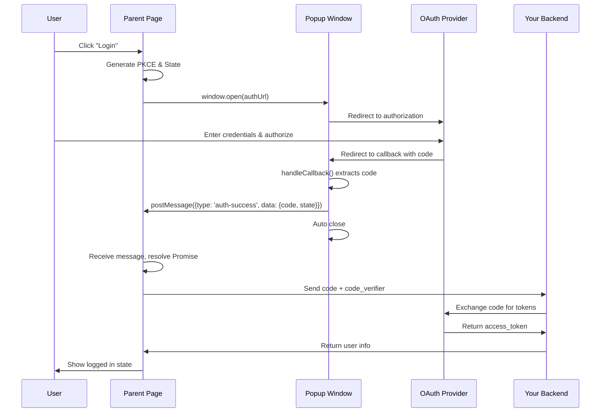

# auth-popup

[](https://www.npmjs.com/package/auth-popup)
[](https://opensource.org/licenses/MIT)

A robust, standardized solution for OAuth/SSO popup authorization in web applications.

[中文文档](./README.zh-CN.md) | [LLM/Agent Reference](./llms.txt)

## Features

- 🔐 **Secure** - Built-in XSS protection, origin validation, and PKCE support
- 📱 **Cross-platform** - Automatic fallback for mobile devices and popup blockers
- 🔄 **Dual communication** - Uses both BroadcastChannel and postMessage for reliability
- 📦 **Zero dependencies** - Lightweight and tree-shakeable
- 🎯 **TypeScript first** - Full type definitions included
- ⚡ **Modern** - ES modules with UMD fallback
- 🤖 **AI-friendly** - Comprehensive [llms.txt](./llms.txt) for LLM/Agent integration

https://github.com/user-attachments/assets/c1c6ccb9-b23a-416b-9f6c-395adc493150

## How It Works



### Flow Summary

1. **Parent Page** opens a popup with the OAuth authorization URL
2. **User** authenticates with the OAuth provider
3. **OAuth Provider** redirects to your callback page with an authorization code
4. **Callback Page** uses `handleCallback()` to extract the code and send it back to the parent via `postMessage`
5. **Parent Page** receives the code and exchanges it for tokens via your backend

## Installation

```bash
npm install auth-popup
```

```bash
yarn add auth-popup
```

```bash
pnpm add auth-popup
```

## Quick Start

### 1. Parent Page (Open Popup)

```typescript
import { AuthPopup, generatePKCE, generateState } from 'auth-popup';

async function login() {
  // Generate PKCE challenge (recommended)
  const pkce = await generatePKCE();
  const state = generateState();

  // Store for later verification
  sessionStorage.setItem('pkce_verifier', pkce.codeVerifier);
  sessionStorage.setItem('auth_state', state);

  // Build authorization URL
  const authUrl = new URL('https://auth.example.com/authorize');
  authUrl.searchParams.set('client_id', 'your-client-id');
  authUrl.searchParams.set('redirect_uri', 'https://yourapp.com/callback');
  authUrl.searchParams.set('response_type', 'code');
  authUrl.searchParams.set('scope', 'openid profile');
  authUrl.searchParams.set('state', state);
  authUrl.searchParams.set('code_challenge', pkce.codeChallenge);
  authUrl.searchParams.set('code_challenge_method', 'S256');

  try {
    const result = await AuthPopup.open({
      authUrl: authUrl.toString(),
      width: 500,
      height: 600,
      timeout: 120000,
      allowedOrigins: [window.location.origin],
    });

    console.log('Authorization code:', result.code);
    console.log('State:', result.state);

    // Exchange code for tokens on your backend
    await exchangeCodeForTokens(result.code, pkce.codeVerifier);
  } catch (error) {
    console.error('Authorization failed:', error);
  }
}
```

### 2. Callback Page

Create a simple callback page at your redirect URI:

```html
<!-- callback.html -->
<!DOCTYPE html>
<html>
  <head>
    <title>Authorization Callback</title>
  </head>
  <body>
    <p>Processing authorization...</p>
    <script type="module">
      import { handleCallback } from 'https://cdn.jsdelivr.net/npm/auth-popup/+esm';

      const result = handleCallback({
        allowedOrigins: ['https://yourapp.com'],
        autoClose: true,
        autoCloseDelay: 100,
      });

      if (!result.success) {
        document.body.innerHTML = `<p>Error: ${result.data.error_description || result.data.error}</p>`;
      }
    </script>
  </body>
</html>
```

**Alternative (UMD):** For older browsers or projects without module support:

```html
<script src="https://unpkg.com/auth-popup@latest/dist/auth-popup.umd.cjs"></script>
<script>
  const result = window.AuthPopup.handleCallback({
    allowedOrigins: ['https://yourapp.com'],
    autoClose: true,
  });
  if (!result.success) {
    document.body.innerHTML = `<p>Error: ${result.data.error_description || result.data.error}</p>`;
  }
</script>
```

## API Reference

### AuthPopup.open(options)

Opens an authorization popup and returns a Promise that resolves with the authorization result.

#### Options

| Option             | Type       | Default             | Description                              |
| ------------------ | ---------- | ------------------- | ---------------------------------------- |
| `authUrl`          | `string`   | _required_          | The authorization URL to open            |
| `width`            | `number`   | `500`               | Popup window width in pixels             |
| `height`           | `number`   | `600`               | Popup window height in pixels            |
| `timeout`          | `number`   | `120000`            | Timeout in milliseconds (2 minutes)      |
| `redirectFallback` | `boolean`  | `true`              | Fallback to redirect if popup is blocked |
| `allowedOrigins`   | `string[]` | `[location.origin]` | Allowed origins for postMessage          |
| `forceClosePopup`  | `boolean`  | `false`             | Force close popup on completion          |

#### Returns

```typescript
Promise<{
  code: string; // Authorization code
  state?: string; // State parameter (if provided)
}>;
```

### handleCallback(options) / CallbackHandler.init(options)

Processes the OAuth callback and sends the result to the parent window.

#### Options

| Option           | Type       | Default    | Description                       |
| ---------------- | ---------- | ---------- | --------------------------------- |
| `allowedOrigins` | `string[]` | _required_ | Allowed parent window origins     |
| `autoClose`      | `boolean`  | `true`     | Auto-close popup after processing |
| `autoCloseDelay` | `number`   | `100`      | Delay before auto-closing (ms)    |

#### Returns

```typescript
{
  success: boolean;
  data: AuthResult | AuthError;
}
```

### Security Utilities

#### generatePKCE()

Generates a PKCE (Proof Key for Code Exchange) challenge pair.

```typescript
const pkce = await generatePKCE();
// {
//   codeVerifier: string,    // 128-character random string
//   codeChallenge: string,   // Base64URL-encoded SHA-256 hash
//   codeChallengeMethod: 'S256'
// }
```

#### generateState()

Generates a random state parameter for CSRF protection.

```typescript
const state = generateState(); // 32-character random string
```

#### validateOrigin(origin, allowedOrigins)

Validates an origin against an allowed list.

```typescript
validateOrigin('https://example.com', ['https://example.com']); // true
validateOrigin('https://evil.com', ['https://example.com']); // false
```

### Browser Utilities

#### detectBrowser()

Detects browser capabilities and type.

```typescript
const info = detectBrowser();
// {
//   isMobile: boolean,
//   isTablet: boolean,
//   isSafari: boolean,
//   isChrome: boolean,
//   isEdge: boolean,
//   supportsPopup: boolean
// }
```

#### isPopupBlocked(popup)

Checks if a popup window was blocked by the browser.

```typescript
const popup = window.open(url);
if (isPopupBlocked(popup)) {
  // Handle blocked popup
}
```

## Browser Support

- Chrome 80+
- Firefox 75+
- Safari 13.1+
- Edge 80+
- Mobile browsers (automatic fallback to new tab)

## Security Considerations

1. **Always validate the state parameter** to prevent CSRF attacks
2. **Use PKCE** for public clients (SPAs, mobile apps)
3. **Restrict `allowedOrigins`** to only trusted domains
4. **Never use `*` wildcard** in production for origin validation
5. **Exchange authorization codes server-side** to protect client secrets

## License

MIT
