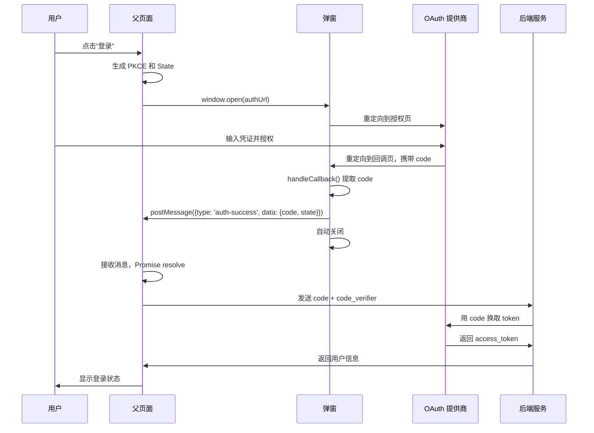

# auth-popup

[](https://www.npmjs.com/package/auth-popup)
[](https://opensource.org/licenses/MIT)

一个健壮、标准化的 OAuth/SSO 弹窗授权解决方案。

[English](./README.md) | [LLM/Agent 参考文档](./llms.txt)

## 特性

- 🔐 **安全** - 内置 XSS 防护、来源验证和 PKCE 支持
- 📱 **跨平台** - 自动适配移动设备和弹窗拦截器
- 🔄 **双通道通信** - 同时使用 BroadcastChannel 和 postMessage 确保可靠性
- 📦 **零依赖** - 轻量且支持 tree-shaking
- 🎯 **TypeScript 优先** - 完整的类型定义
- ⚡ **现代化** - ES 模块，兼容 UMD
- 🤖 **AI 友好** - 提供完善的 [llms.txt](./llms.txt) 供 LLM/Agent 集成

https://github.com/user-attachments/assets/c1c6ccb9-b23a-416b-9f6c-395adc493150

## 工作原理



### 流程说明

1. **父页面** 打开一个弹窗，指向 OAuth 授权 URL
2. **用户** 在 OAuth 提供商页面完成身份验证
3. **OAuth 提供商** 重定向到你的回调页面，携带授权码（code）
4. **回调页面** 使用 `handleCallback()` 提取 code，并通过 `postMessage` 发送给父页面
5. **父页面** 接收 code，通过后端服务换取 token

## 安装

```bash
npm install auth-popup
```

```bash
yarn add auth-popup
```

```bash
pnpm add auth-popup
```

## 快速开始

### 1. 父页面（打开弹窗）

```typescript
import { AuthPopup, generatePKCE, generateState } from 'auth-popup';

async function login() {
  // 生成 PKCE 挑战（推荐）
  const pkce = await generatePKCE();
  const state = generateState();

  // 存储以便后续验证
  sessionStorage.setItem('pkce_verifier', pkce.codeVerifier);
  sessionStorage.setItem('auth_state', state);

  // 构建授权 URL
  const authUrl = new URL('https://auth.example.com/authorize');
  authUrl.searchParams.set('client_id', 'your-client-id');
  authUrl.searchParams.set('redirect_uri', 'https://yourapp.com/callback');
  authUrl.searchParams.set('response_type', 'code');
  authUrl.searchParams.set('scope', 'openid profile');
  authUrl.searchParams.set('state', state);
  authUrl.searchParams.set('code_challenge', pkce.codeChallenge);
  authUrl.searchParams.set('code_challenge_method', 'S256');

  try {
    const result = await AuthPopup.open({
      authUrl: authUrl.toString(),
      width: 500,
      height: 600,
      timeout: 120000,
      allowedOrigins: [window.location.origin],
    });

    console.log('授权码:', result.code);
    console.log('状态:', result.state);

    // 在后端交换令牌
    await exchangeCodeForTokens(result.code, pkce.codeVerifier);
  } catch (error) {
    console.error('授权失败:', error);
  }
}
```

### 2. 回调页面

在重定向 URI 创建一个简单的回调页面：

```html
<!-- callback.html -->
<!DOCTYPE html>
<html>
  <head>
    <title>授权回调</title>
  </head>
  <body>
    <p>正在处理授权...</p>
    <script type="module">
      import { handleCallback } from 'https://cdn.jsdelivr.net/npm/auth-popup/+esm';

      const result = handleCallback({
        allowedOrigins: ['https://yourapp.com'],
        autoClose: true,
        autoCloseDelay: 100,
      });

      if (!result.success) {
        document.body.innerHTML = `<p>错误: ${result.data.error_description || result.data.error}</p>`;
      }
    </script>
  </body>
</html>
```

**替代方案 (UMD)：** 适用于旧版浏览器或不支持模块的项目：

```html
<script src="https://cdn.jsdelivr.net/npm/auth-popup"></script>
<script>
  const result = window.AuthPopup.handleCallback({
    allowedOrigins: ['https://yourapp.com'],
    autoClose: true,
  });
  if (!result.success) {
    document.body.innerHTML = `<p>错误: ${result.data.error_description || result.data.error}</p>`;
  }
</script>
```

## API 参考

### AuthPopup.open(options)

打开授权弹窗，返回一个 Promise，成功时解析为授权结果。

#### 选项

| 选项               | 类型       | 默认值              | 描述                          |
| ------------------ | ---------- | ------------------- | ----------------------------- |
| `authUrl`          | `string`   | _必填_              | 授权 URL                      |
| `width`            | `number`   | `500`               | 弹窗宽度（像素）              |
| `height`           | `number`   | `600`               | 弹窗高度（像素）              |
| `timeout`          | `number`   | `120000`            | 超时时间（毫秒，默认 2 分钟） |
| `redirectFallback` | `boolean`  | `true`              | 弹窗被拦截时是否回退到重定向  |
| `allowedOrigins`   | `string[]` | `[location.origin]` | postMessage 允许的来源        |
| `forceClosePopup`  | `boolean`  | `false`             | 完成时强制关闭弹窗            |

#### 返回值

```typescript
Promise<{
  code: string; // 授权码
  state?: string; // 状态参数（如果提供）
}>;
```

### handleCallback(options) / CallbackHandler.init(options)

处理 OAuth 回调并将结果发送给父窗口。

#### 选项

| 选项             | 类型       | 默认值 | 描述                   |
| ---------------- | ---------- | ------ | ---------------------- |
| `allowedOrigins` | `string[]` | _必填_ | 允许的父窗口来源       |
| `autoClose`      | `boolean`  | `true` | 处理完成后自动关闭弹窗 |
| `autoCloseDelay` | `number`   | `100`  | 自动关闭延迟（毫秒）   |

#### 返回值

```typescript
{
  success: boolean;
  data: AuthResult | AuthError;
}
```

### 安全工具

#### generatePKCE()

生成 PKCE（Proof Key for Code Exchange）挑战对。

```typescript
const pkce = await generatePKCE();
// {
//   codeVerifier: string,    // 128 位随机字符串
//   codeChallenge: string,   // Base64URL 编码的 SHA-256 哈希
//   codeChallengeMethod: 'S256'
// }
```

#### generateState()

生成用于 CSRF 防护的随机状态参数。

```typescript
const state = generateState(); // 32 位随机字符串
```

#### validateOrigin(origin, allowedOrigins)

验证来源是否在允许列表中。

```typescript
validateOrigin('https://example.com', ['https://example.com']); // true
validateOrigin('https://evil.com', ['https://example.com']); // false
```

### 浏览器工具

#### detectBrowser()

检测浏览器能力和类型。

```typescript
const info = detectBrowser();
// {
//   isMobile: boolean,
//   isTablet: boolean,
//   isSafari: boolean,
//   isChrome: boolean,
//   isEdge: boolean,
//   supportsPopup: boolean
// }
```

#### isPopupBlocked(popup)

检查弹窗是否被浏览器拦截。

```typescript
const popup = window.open(url);
if (isPopupBlocked(popup)) {
  // 处理弹窗被拦截的情况
}
```

## 浏览器支持

- Chrome 80+
- Firefox 75+
- Safari 13.1+
- Edge 80+
- 移动端浏览器（自动回退到新标签页）

## 安全注意事项

1. **始终验证 state 参数** 以防止 CSRF 攻击
2. **使用 PKCE** 用于公共客户端（SPA、移动应用）
3. **限制 `allowedOrigins`** 仅允许受信任的域名
4. **生产环境切勿使用 `*` 通配符** 进行来源验证
5. **在服务端交换授权码** 以保护客户端密钥

## 许可证

MIT
